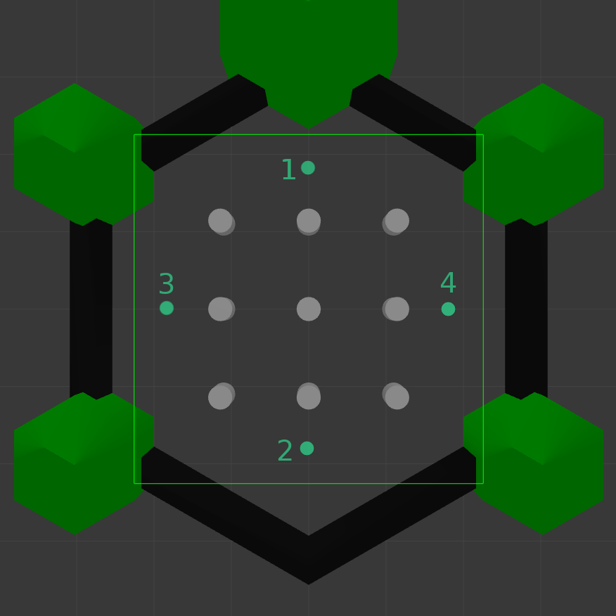

# Path Planning Benchmark

## Settings

All adjustable parameter can be found in the settings file: `settings/settings.json`:
```
{
  "model_name": "turtlebot3",
  "model_type": "burger",
  "namespace": "tb3_",
  "number_of_robots": 4,
  "formation": "dense_block",
  "position": [1.5, 0.5, 0.5],
  "orientation": [0.0, 0.0, 0.0]
  "wp_map": "edge_tb3_world",
  "wp_threshold": 0.2
}
```
- The **Model Name** defines the robot model to be used.
This can be set to: `turltebot3`.
- The **Model Type** defines the type of the robot model.
This can be set to: `burger`, `waffle`, or `waffle_pi`
for the `turtlebot3` model.
- The **Namespace** defines the String, which will be put in front
of the robot name for all topics and so on.
This can be set to every arbitrary String.
- The **Number of Robots** defines the number of robots, which should
be spawned and used in the benchmark.
This can be set to every Integer.
- The **Formation** defines where the robots should be spawned.
This can be set to `dense_block` or `at_way_point`.
- The **Position** defines the position in the map for the spawning.
This is only be used, when the formation is set to `dense_block`, since
for other formations the positions are automatically computed.
This can be set to any valid position vector `[x, y, z]` in the map.
- The **Orientation** defines the orientation of the formation. This is 
similar to the position parameter and will only be used in the `dense_block`
formation. This can be set to any valid orientation euler vector.
- The **Waypoint Map** defines the set of waypoints to be used.
This can be set to `empty_world` or `edge_tb3_world`.
- The **Waypoint Threshold** defines the size of the waypoint.
More specifically, it defines the radius of the waypoint.
This can be set to any Float.

Furthermore, RQT and RVIZ can be started by enabling
the `ÈNABLE_RQT` and `ENABLE_RVIZ` flags, respectively.
These flags can be found in the `scripts/benchmark.sh` file.

## Waypoint Maps

The `edge_tb3_world` contains four waypoints located at the edges of the map:


## Execution

First, make sure you are in the benchmark package.
The benchmark can be executed via:
```
bash ./scripts/benchmark.sh
```
The framework can be closed by typing:
```
bash ./scripts/kill.sh
```
This process can be highly accelerated by creating system keyboard shortcuts like:
```
gnome-terminal -- bash <FULL_PATH>/benchmark.sh
gnome-terminal -- bash <FULL_PATH>/kill.sh
```
